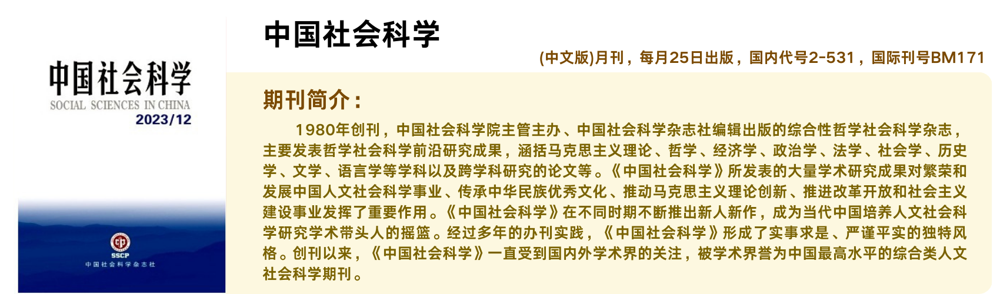
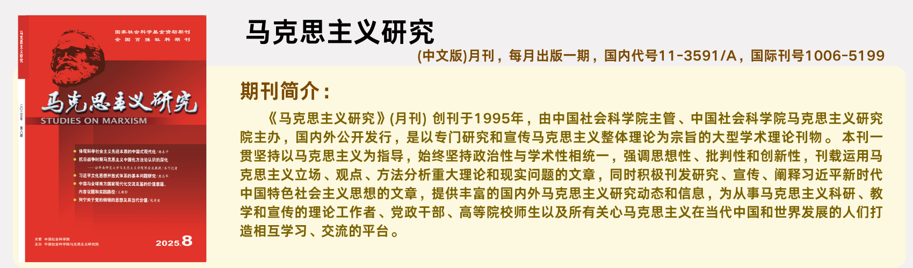
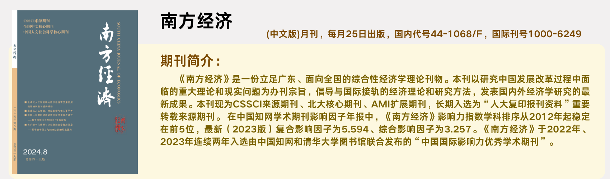
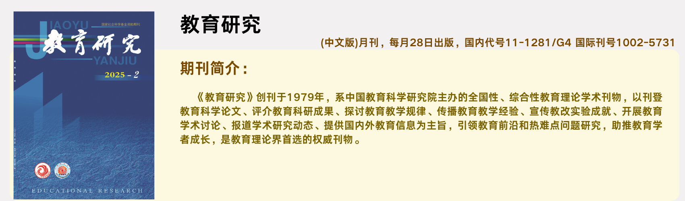

已上线的知识库有

- 《中国社会科学》AI知识库

- 《马克思主义研究》AI知识库

- 《南方经济》AI知识库

- 《教育研究》AI知识库

  

《中国社会科学》 AI知识库
-------------

 [source][1]

- 最新发布，涵盖2024年到至今的所有文献，共拆解833颗种子
- 深度迁移，辅助创作，效率提升
- 通过调用此库，可帮助学习《中国社会科学》期刊的行文逻辑和风格
- 有助于产出高质量的人文社科领域文章

**《中国社会科学》2025年重点选题**

- 21世纪马克思主义的学理化阐释
- 中国式现代化与世界现代化
- 中国自主知识体系与标识性概念
- 全面深化改革与高水平对外开放
- 新质生产力与高质量发展
- 国家治理与全球治理
- 文明演进与文明互鉴
- 文化：在传统与现代之间
- 人工智能与经济社会发展
- 跨学科、交叉学科与新兴学科
- 学术基本理论、基本问题、基本方法再反思

《马克思主义研究》 AI知识库
-------------
[source][2]

- 首批上线，涵盖《马克思主义研究》2024年截至目前的所有文献，共拆解 2k+ 颗种子
- 海量文献，精准问答，权威解读，专业辅助
- 告别繁琐检索，智能关联分析。激发科研灵感，追踪学术前沿
- 深度解码马克思主义经典理论与当代实践

**《马克思主义研究》2025年选题导引**

- 党的二十届三中全会精神研究阐释
- 习近平新时代中国特色社会主义思想研究
- 习近平新时代中国特色社会主义思想的体系化学理化阐释
- 习近平新时代中国特色社会主义思想的世界观和方法论研究
- 习近平总书记关于全面深化改革的一系列新思想、新观点、新论断研究
- 习近平文化思想研究
- 习近平总书记关于党的建设的重要思想研究
- 习近平总书记关于党的自我革命的重要思想研究
- 新质生产力和新型生产关系研究
- 文明基本理论与新型文明观研究
- "两个结合"与马克思主义中国化时代化研究
- 马克思主义学科体系、学术体系、话语体系研究
- 马克思主义立场观点方法研究
- 马克思主义经典作家文化理论研究
- 中国式现代化理论体系与重大实践问题研究
- 中国式现代化与人类文明新形态研究
- 全体人民共同富裕研究
- 社会主义基本经济制度研究
- 全过程人民民主研究
- 马克思主义引领当代社会思潮研究
- 全人类共同价值与人类命运共同体研究
- 当代资本主义新表现及发展趋势研究
- 世界马克思主义与社会主义研究
- 世界百年未有之大变局与"全球南方"问题研究
- "东升西降"与"西强东弱"研究

[link][7]

《南方经济》 AI知识库
-------------
[source][3]

- 囊括《南方经济》期刊 2024年截至目前 所有期刊资源，首发资源，包含1k+ 颗种子
- 汇聚前沿经济智慧，洞见区域发展先机
- 从微观实证到宏观战略，一站式洞察中国经济发展的深层逻辑
- 与经济学者同行，与前沿研究同步，助力打造您专业学术研究的权威伙伴

**《南方经济》2025年重点选题**

- 最新技术前沿、产业前沿特征、趋势与治理 
- 健全宏观经济治理体系与宏观调控体系
- 深化财税与金融体制改革
- 金融强国建设与全球金融治理
- 收入分配制度与高质量充分就业
- 扩大内需和居民消费
- 人口老龄化背景下的高质量发展
- 人工智能技术变革对我国经济社会发展的影响及对策
- 全球经贸规则体系变化与制度型开放
- 贸易强国制度支撑和政策支持体系建设
- 外商投资和对外投资管理体制机制
- "一带一路"与粤港澳大湾区建设
- 发展新质生产力与完善现代化产业体系
- 实体经济与数字经济深度融合发展
- 科技创新与产业创新融合发展
- 国有经济和民营经济高质量协同发展
- 城乡融合发展背景下的新型城镇化、县域经济发展和乡村全面振兴

[link][4]

《教育研究》 AI知识库
-------------
[source][6]

- 首次上线《教育研究》期刊 2024年截至目前全部文献资源，解析生成 2k+ 颗种子
- 深耕教育理论，赋能研究实践，打造您的专属学术智库
- 解读教育规律，启发思维创新，从教育经典到未来趋势，一站式贯通教育研究脉络
- 让前沿研究助力教育实践，赋能教师/学者/政策制定者

**《教育研究》2025年选题要点**

- 学习贯彻党的二十届三中全会精神和全国教育大会精神研究

- 教育强国建设研究

- 立德树人机制研究

- 中国教育学自主知识体系构建研究

- 德智体美劳全面培养体系研究

- 大中小学思政课一体化改革创新研究

- 人工智能与教育变革研究

- 人口变化与教育资源统筹调配机制研究

- 学前教育普及普惠研究

- 义务教育优质均衡和城乡一体化研究

- 高中阶段学校多样化发展研究

- 现代职业教育体系研究

- 高等教育布局与学科设置调整机制研究

- 世界重要教育中心研究

- 高等教育综合改革研究

- 学习型社会研究

- 拔尖创新人才发现和培养机制研究

- 统筹推进教育科技人才体制机制一体改革研究

- 教育评价改革研究

- 高水平教育开放研究

- 课程改革与高质量教材研究

- 数字赋能教学方式变革研究

- 教育家精神与教师队伍建设研究

- 人才培养与经济社会发展需要适配机制研究

- 依法治教和管理研究

[link][5]

> ##### TIP
>
> Thanks for usage.
{: .block-tip }

[1]: https://www.cssn.cn/dkzgxp/zgxp_zgshkx/
[2]: https://mkszyyj.ajcass.com/Home/Index
[3]:http://www.nanfangjingji.cn/CN/home
[4]:http://www.nanfangjingji.cn/CN/news/news11.shtml
[5]: https://jyyj.cnaes.edu.cn/post/3

[6]: https://jyyj.cnaes.edu.cn/
[7]: https://mkszyyj.ajcass.com/Show/1509?itemid=158873

