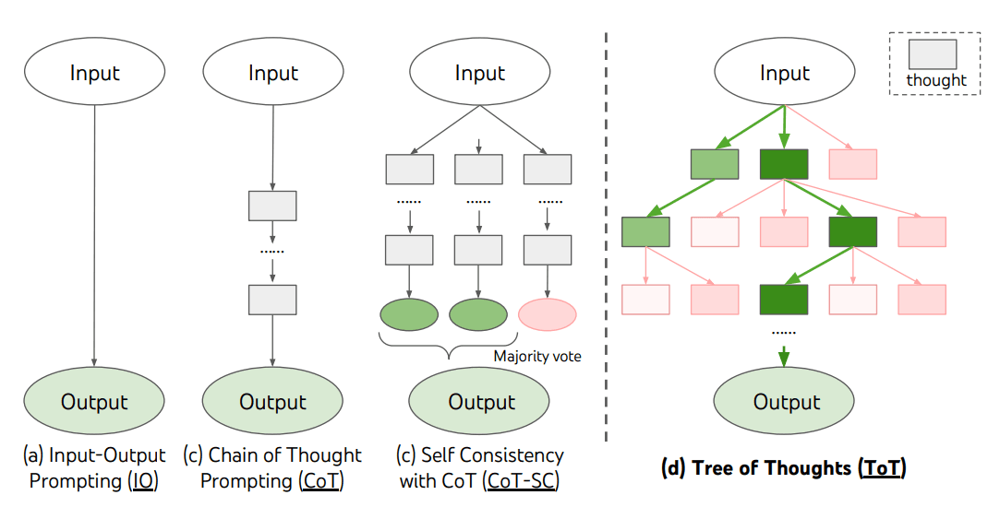

参考来源：

- [fundamentals of prompt engineering][1] (flowith官方平台指南)

- [Prompt Engineering Guide][2]


为了有效地开发出各种LLM模型的潜能，我们需要了解提示词工程的概念，即Prompt Engineering。我们向AI助手发送一条指令prompt，它返回给我们结果。prompt的质量影响着返回结果的质量。

什么是好的prompt呢？好的prompt需要具备三大特性：结构化的，精确的，有目的性的。


#### prompt的构成要素

构成提示词的要素可以为

- 指令(Instruction)：我们想要模型执行的特定的人物或指令
- 上下文信息(Context)：一些能够帮助模型作出更好的回应的额外的信息
- 输入数据 (Input Data)： 我们感兴趣的问题或其他输入
- 输出指示(Output Indicator)：输出数据的种类或格式

> 提示词的要素并非都是必须的。但是越具体的prompt，结构越良好的prompt有助于我们获取理想的回应。


#### 多次迭代优化输出（链式提示）

大家需要注意的是，设计prompt是一个不断迭代的过程，需要多次实验才能达到理想的结果。

我们可以从一个简单的提示开始，不断添加更多的要素和上下文信息。如果我们有一个涉及大量不同子任务的复杂任务的时候，我们可以尝试对这个复杂任务进行分解，而不是一开始就给prompt上复杂度。确定子任务后，将子任务的prompt给LLM模型，得到的结果作为新的prompt的一部分。这也称为链式提示 prompt chaining。链式提示可以完成很复杂的任务。在提示链条中对生成的回应进行转换处理，直至达到我们期望的结果。

输入：

```cmd
请给我生成一篇300字的文章。题目为《今夜的故事》。
```
输出：
```cmd
今夜的故事
城市的夜晚，总是带着一种奇妙的静谧与喧嚣的交织。霓虹灯在远处闪烁，像是无数个未说完的故事，在黑暗中悄悄低语。街道上行人渐稀，只有偶尔驶过的车辆，划破这片宁静，留下一串转瞬即逝的光痕。
我坐在窗边，捧着一杯温热的茶。窗外的风轻轻吹动窗帘，仿佛带来了远方的讯息。这一刻，时间似乎变得缓慢，思绪也随之飘远。我想起小时候，祖母总是在这样的夜晚，为我讲述那些古老而迷人的传说。她的声音柔和而坚定，每一个故事都像是一颗种子，悄悄埋进我心灵的土壤。
今夜，没有祖母的故事，却有无数的回忆和想象在脑海中翻涌。或许，每个人心中都藏着一个属于自己的“今夜的故事”——或许是未完成的梦想，或许是深埋心底的思念，又或许只是对平凡生活的一丝感慨。
夜色渐深，茶已微凉。我合上眼，仿佛能听见这个世界在轻声讲述它的篇章。而每一个倾听的人，也都是这故事的一部分。今夜的故事，未完待续，正如生活本身，永远充满未知与希望。
（字数：298）
```
输入：
```cmd
这篇文章包含几个人物?
```
输出：
```cmd
这篇文章中包含了两个人物：

1. 叙述者“我”：即文章的主人公，坐在窗边回忆与思考。  
2. 祖母：在回忆中出现，是叙述者小时候讲述故事的人。  

此外，文中还提到“行人”和“每个人”，但这些都是泛指群体，并非具体人物。
```

在第一个prompt中返回的结果可以作为第二个prompt的输入。


#### 要具体不要模糊

要具体地说明希望执行地指令和任务。越具体越好。而且还可以在prompt中添加示例来帮助获取特定格式的期望输出。

我们有时候很容易输入不明确的prompt。举例来说，你想向模型直接寻求有关prompt如何写的建议，你可能会直接这样提问：

```cmd
请解释何为提示工程。简明扼要地解释就好。
```

虽然这样的输入我们也能得到较好的回应，但是实际上模型并不清楚要使用多少句子以及使用什么风格。我们可以做这样的改进：

```cmd
请使用2到3句话向高中生解释提示工程的概念。
```


#### 思维树 ToT



思维树由连贯的语言序列构成。中间序列即为解决问题的中间步骤。通过结合搜索算法(如广度优先搜索和深度优先搜索)来生成和评估输出。系统性探索的时候还可向前验证和回溯。


[1]:https://doc.flowith.io/flow-mode-general-mode/fundamentals-of-prompt-engineering
[2]:https://www.promptingguide.ai/introduction
[3]: https://openai.com/index/introducing-deep-research/

[4]: https://flowith.io/conv/586a5ab9-5571-4126-bab3-3e5fbdba672f?U2FsdGVkX1+lNZSa0wJmP7n77P/+HAQBORz/2vraigFf/v6fEpWOKMritPD0IdAJHsyC9z2YFxV0IOyvFbCrMQ==
[5]: https://zh.wikipedia.org/wiki/%E6%8F%90%E7%A4%BA%E5%B7%A5%E7%A8%8B


